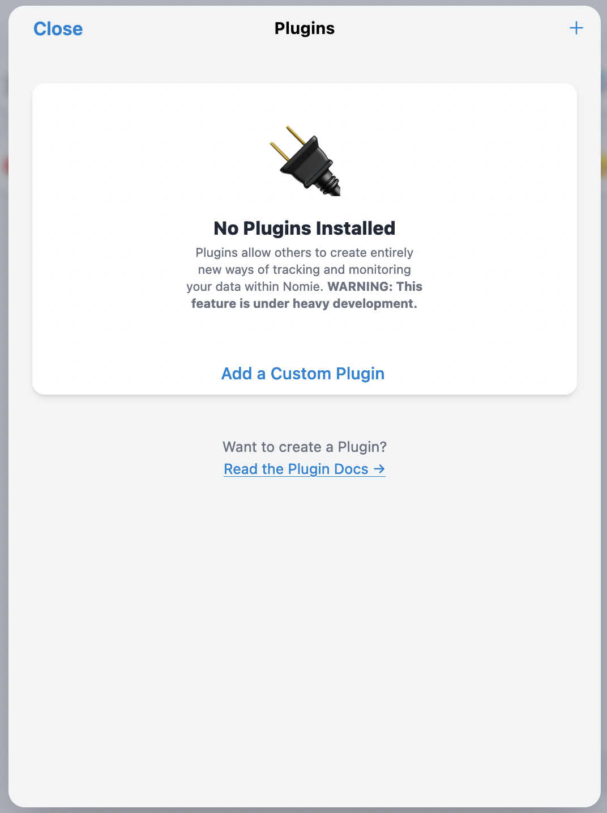
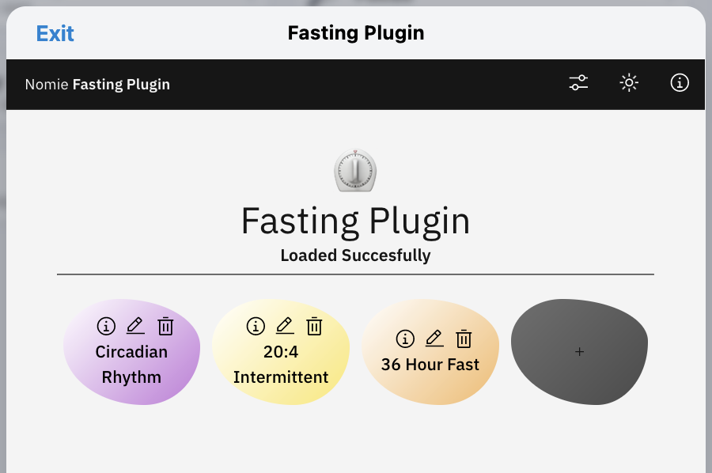
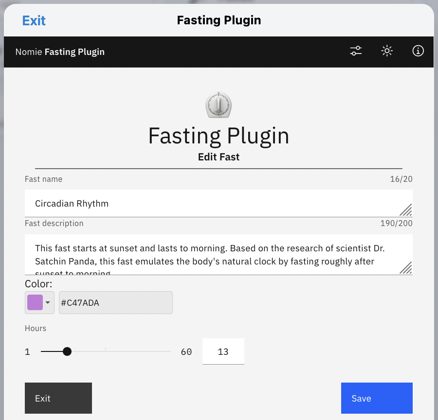
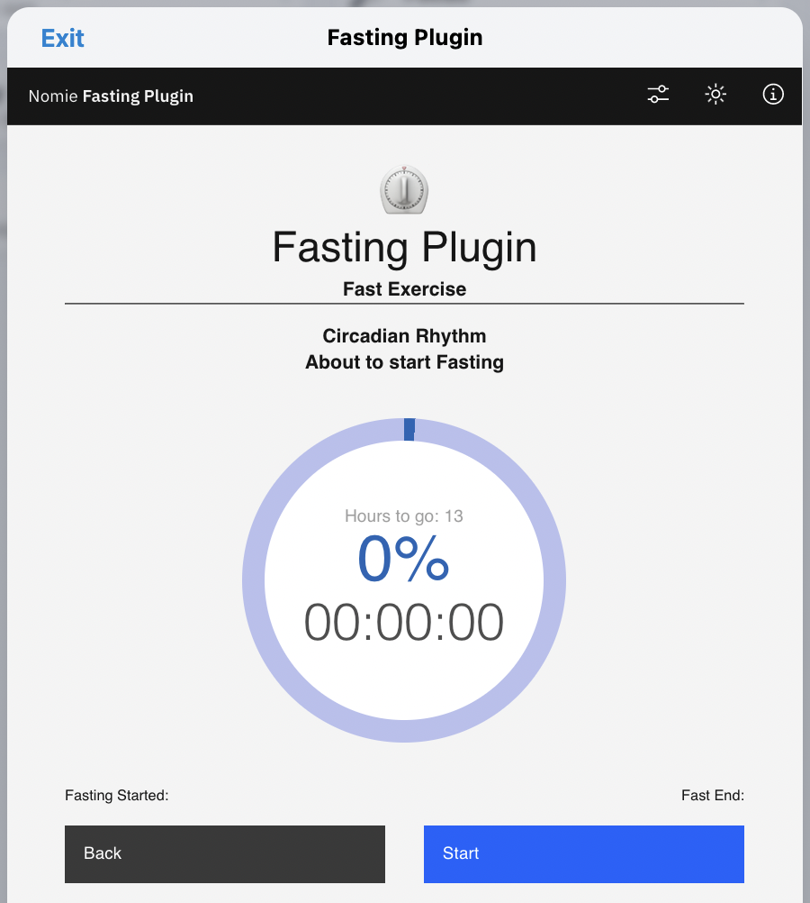
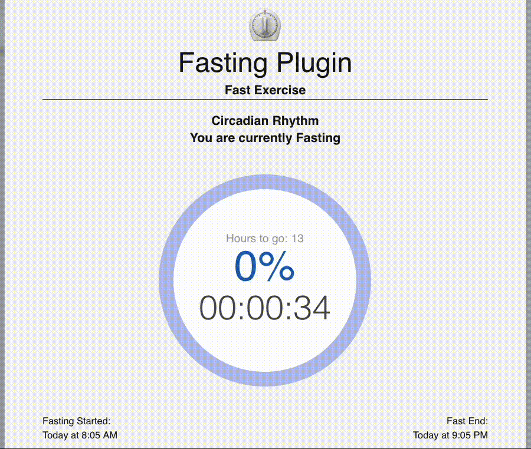
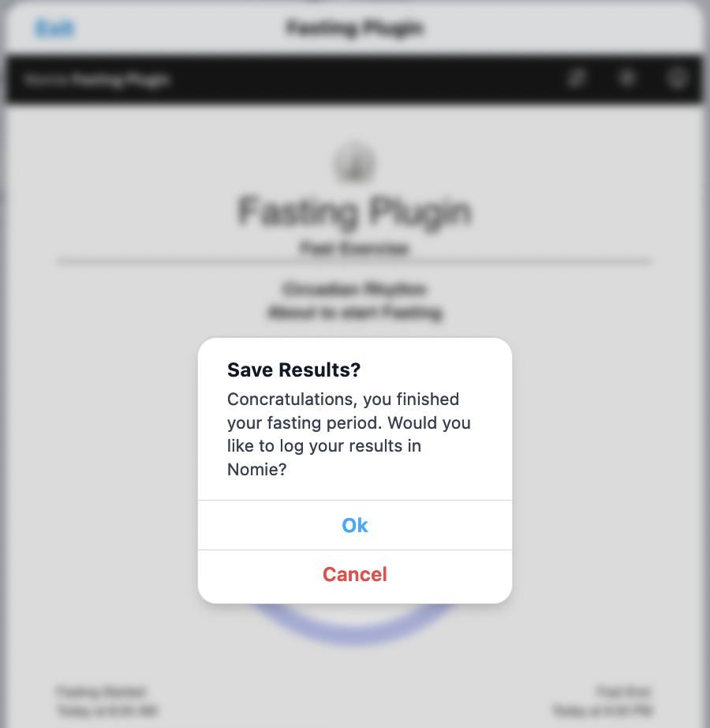
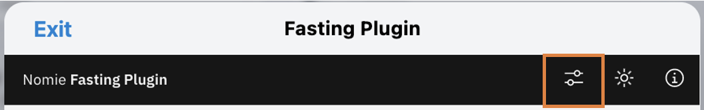
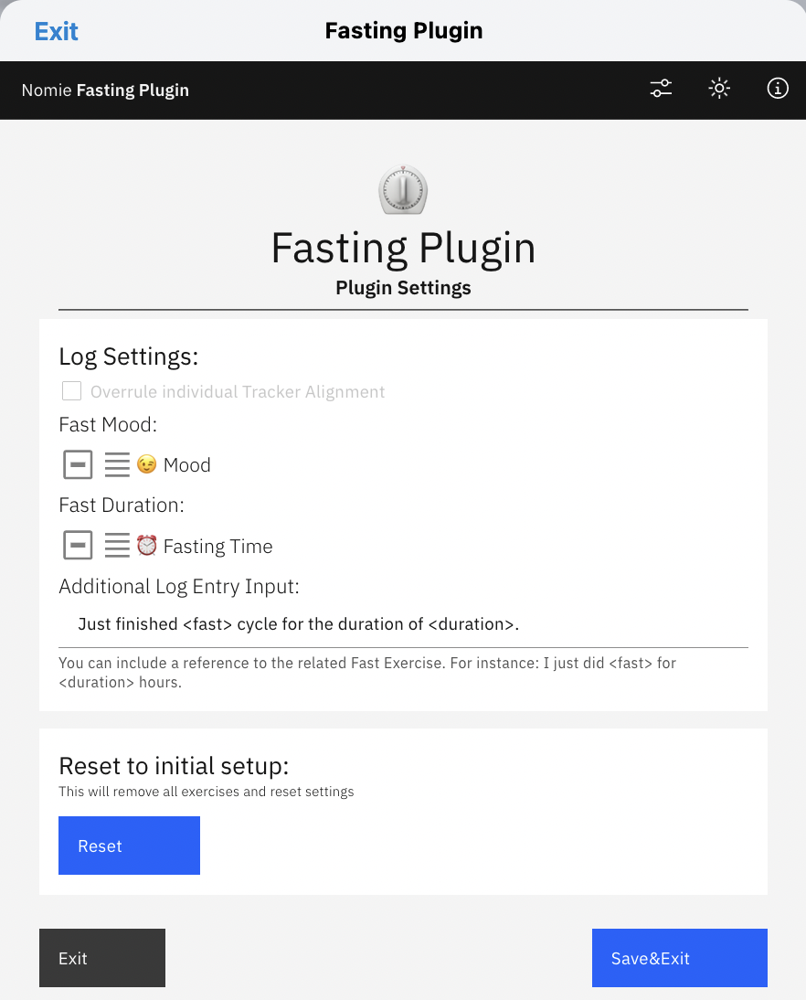
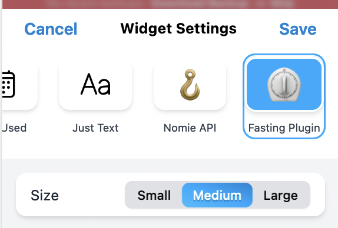
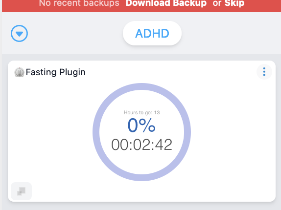

# ⏲Nomie Fasting Plugin

The ⏲Nomie Fasting Plugin is a plugin for Nomie6-oss.

## About the ⏲Nomie Fasting Plugin

The Nomie Fasting Plugin will support your fasting exercises by defining a preset of fasting cycles and (in the background) keep track of the progress of your current fasting. You can choose to use one of the predefined fasting cycles or you can create your own.

When your fasting cycle is completed the plugin can autmatically log your results (duration and mood) to the Nomie Trackables of your choice.

## Installing the Plugin

The url of the plugin is:

[https://dailynomie.github.io/nomie-plugin-fast/](https://dailynomie.github.io/nomie-plugin-fast/)

The ⏲Nomie Fasting Plugin can be installed in Nomie via the following steps:

* Go to the More Tab
* Select Plugins
* Click the + or Add Custom Plugin
* Provide the url for the plugin
* Tap Install Plugin

## Using the Plugin

After launching the plugin, you will be presented with the main screen. This screen will show all your selected pre-defined fasting cycles and/or your own defined cycles.

### Editing a Fasting

By clicking on the edit button you can change the main parameters of the selected fasting:

Most of the options are self explanatory. The hours represents the amount of hours the cycle should last.

Once ready with editing you can select the 'Save' button.

### Starting a fasting

You can start a cycle by clicking on one of the selected breathings on the main screen. You will see the following screen:

Just click on the 'Start' button and the timer will start for you:

When the exercise is finished (and when defined in your configuration settings) you can automatically log your achievements in Nomie:

## Configuring the Plugin

The settings of the plugin can be changed via the 'settings' button at the top of the screen:

You will be presented with the following options:

First of all you can define to which Trackables the duration and your mood will be logged after you finsihed a cycle. In above example I log my results in the Trackables 'Mood' & 'Fasting Time'

You can also include some additional text in your log/note. Within this text you can use the keywords fast and duration to represent these parameters from the exercise you just finished. Please make sure to include these keywords between <>.

The final Reset option is descructive 😄 It will reset the plugin and remove all your predefined cycles on the main screen.

## The Widget

You can add the related fastig widget to your dashboard by selecting the widgt to add to your dashboard:

Once the widget is on the dashboard it will represent the current progress of your fasting cycle:

Well, I guess there is nothing more to explain.

As always...have fun with it!
